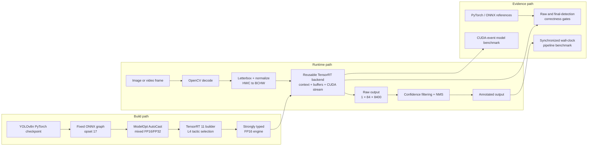
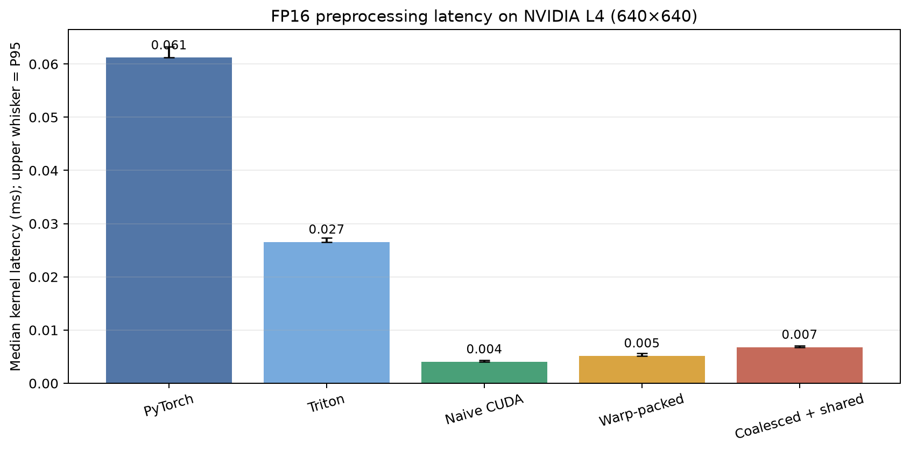
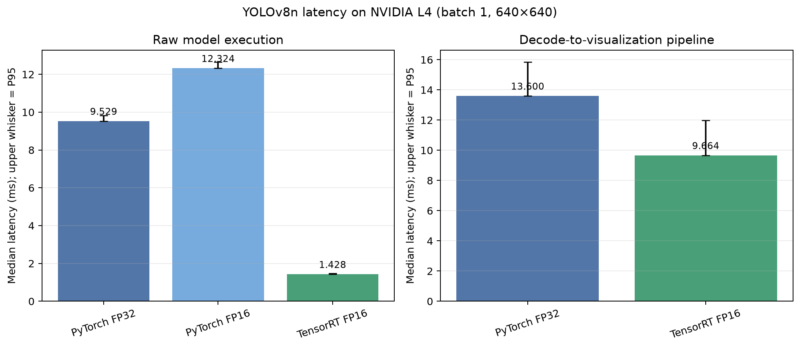

# KernelVision Final Report

## Executive summary

KernelVision is a correctness-first study of GPU optimization inside a real
YOLOv8n object-detection pipeline. It starts with a measurable PyTorch
baseline, isolates preprocessing, implements the same operation in Triton and
CUDA, integrates a custom CUDA operator back into PyTorch, exports the model
through ONNX, and deploys it as a TensorRT FP16 engine on an NVIDIA L4.

The main result is deliberately split into two scopes:

- TensorRT FP16 reduced raw model median latency from `9.529 ms` to
  `1.428 ms`, a `6.671×` model-only speedup.
- The complete decode-to-visualization pipeline improved from `13.600 ms` to
  `9.664 ms`, a `1.407×` end-to-end speedup.

The difference is Amdahl's law in practice: TensorRT accelerates the neural
network, while image decode, preprocessing, NMS, and rendering remain.

## Final demo

The image below was produced from the TensorRT FP16 engine on a Modal NVIDIA
L4. COCO names are supplied as display metadata because the raw engine stores
no Ultralytics class-name mapping.


The engine returned five detections: four people and one bus. The machine-
readable output is in
[`results/tensorrt_fp16_bus_demo.json`](../results/tensorrt_fp16_bus_demo.json).

## Architecture



## Implementation journey

| Milestone | Capability added | Main lesson |
|---|---|---|
| 0 | Package, CLI, environment reporting | Reproducibility begins before optimization. |
| 1 | Image and video inference | Load the model once and reuse it across frames. |
| 2 | Component and end-to-end benchmark harness | GPU synchronization defines valid timing boundaries. |
| 3 | FP32/FP16 correctness and paired timing | Precision comparisons require matched conditions and order controls. |
| 4 | Tensor preprocessing reference | Establish the exact layout, channel, normalization, and dtype contract first. |
| 5 | Triton and standalone CUDA kernels with Nsight profiling | A profiler proposes hypotheses; benchmarks accept or reject them. |
| 6 | PyTorch C++/CUDA extension and pipeline integration | A faster kernel may have a small or inconsistent application effect. |
| 7 | ONNX, TensorRT, reusable runtime, and correctness gates | Deployment optimization is graph-wide, not just reduced precision. |
| 8 | Demo, plots, report, limitations, and reproduction | A performance claim needs scope, evidence, and negative results. |

## Experimental method

All publishable GPU experiments ran on one Modal-hosted NVIDIA L4. Model and
pipeline experiments use batch size 1 with a `640 × 640` model input;
preprocessing experiments also sweep other image shapes. Final performance
runs used 30 warm-ups and 200 measured samples. Comparative experiments use
position-balanced or order-reversed runs to reduce simple first/last-run bias.

Two clocks serve different questions:

- CUDA events measure GPU-only kernel or raw-model execution.
- A synchronized CPU wall clock measures the complete application path.

Compilation, model loading, engine deserialization, and output-file writing
are excluded from steady-state latency. Correctness gates run before
performance experiments. Raw samples remain in the JSON/CSV reports rather
than only retaining aggregate statistics.

## Preprocessing results

The following measurements are warm-cache FP16 preprocessing microbenchmarks
for one `640 × 640` resident input. Host/device transfer, compilation, process
startup, and outer wall-clock time are excluded.



| Implementation | Median | P95 | Speedup over PyTorch |
|---|---:|---:|---:|
| PyTorch reference | 0.061204 ms | 0.063269 ms | 1.000× |
| Triton | 0.026573 ms | 0.027310 ms | 2.303× |
| Naive CUDA | 0.004065 ms | 0.004362 ms | 15.055× |
| Warp-packed CUDA | 0.005181 ms | 0.005693 ms | 11.812× |
| Coalesced/shared-memory CUDA | 0.006799 ms | 0.007107 ms | 9.002× |

The simple CUDA kernel remained fastest. Warp packing improved memory layout
relative to the shared-memory candidate but still added work compared with the
naive implementation. The coalesced/shared-memory version paid synchronization
and staging overhead that exceeded its saved global-memory transactions.

The PyTorch CUDA extension consistently reduced the reported preprocessing
stage by roughly `21–22%`. Its complete-pipeline effect ranged from a `4.05%`
improvement to a `1.30%` regression across position-reversed trials. The
component improvement was real; the end-to-end result was too small relative
to shared pipeline costs and normal runtime variation to claim a stable large
application speedup.

## Profiler findings

Nsight Compute profiled the naive FP32 CUDA preprocessing kernel at
`640 × 640`, block size 256:

| Metric | Observed value |
|---|---:|
| Memory-throughput utilization | 69.59% |
| Compute-throughput utilization | 28.75% |
| DRAM-throughput utilization | 10.91% |
| L1/TEX hit rate | 28.57% |
| L2 hit rate | 99.82% |
| Achieved occupancy | 73.04% |
| Registers per thread | 16 |

The profiler reported inefficient global-load sectors—about `10.7` useful
bytes per 32-byte sector—and long-scoreboard stalls representing about `46.2%`
of cycles between issued instructions. These findings motivated coalesced and
warp-packed candidates. Their measured regressions demonstrate why profiler
estimated-speedup rules are hypotheses rather than guarantees: the suggested
memory improvements introduced extra instructions, staging, and
synchronization into a kernel that was already extremely short.

## TensorRT results



### Raw model execution

| Backend | Median | P95 | Relative to TensorRT |
|---|---:|---:|---:|
| PyTorch FP32 | 9.529 ms | 9.820 ms | 6.671× |
| PyTorch FP16 | 12.324 ms | 12.650 ms | 8.627× |
| TensorRT FP16 | 1.428 ms | 1.477 ms | 1.000× |

The isolated eager-PyTorch FP16 path was `29.3%` slower than FP32 in this
specific model-only harness. Reduced precision alone does not guarantee lower
latency. TensorRT additionally performs graph optimization, fusion, tactic
selection, memory planning, and reusable-buffer execution. The exact PyTorch
FP16 slowdown was not attributed without a dedicated profiler experiment.

### Complete image pipeline

| Backend | Median | Mean | P95 | Median speedup |
|---|---:|---:|---:|---:|
| PyTorch FP32 | 13.600 ms | 13.951 ms | 15.841 ms | 1.000× |
| TensorRT FP16 | 9.664 ms | 10.041 ms | 11.969 ms | 1.407× |

This scope includes decode, preprocessing, host-to-device transfer, model
execution, NMS, and in-memory visualization. It excludes model/engine loading
and file output.

## Correctness evidence

The fixed ONNX graph exposes input `[1, 3, 640, 640]` and output
`[1, 84, 8400]`. PyTorch and ONNX Runtime passed the raw all-close check.

The strict TensorRT FP32 raw gate passed. TensorRT FP16 produced finite values
and matching class scores, although a small fraction of raw pre-NMS box
candidates exceeded the chosen coordinate tolerance. Application-level
validation therefore compared decoded detections:

| Detection metric | Result |
|---|---:|
| PyTorch FP32 detections | 5 |
| TensorRT FP16 detections | 5 |
| Matched detections | 5 |
| Unmatched detections | 0 / 0 |
| Mean matched IoU | 0.997469 |
| Minimum matched IoU | 0.994879 |
| Maximum coordinate difference | 0.546 px |
| Maximum confidence difference | 0.001126 |

Raw numerical disagreement did not change the five final detections after
confidence filtering and NMS.

## Rejected ideas and lessons

- FP16 did not automatically make eager PyTorch faster in the final
  model-only harness.
- Shared memory did not help when its staging and synchronization cost exceeded
  the memory-access saving.
- Better theoretical coalescing did not beat the simplest CUDA mapping.
- A `15×` preprocessing-kernel result did not become a `15×` application
  result because preprocessing is a small fraction of total latency.
- A `6.67×` model-only TensorRT result became `1.41×` end to end for the same
  reason.
- Exact raw FP16 all-close was too blunt to be the only correctness criterion;
  final task output also had to be validated.

## Limitations

- Results cover one NVIDIA L4, batch size 1, and one fixed `640 × 640` engine.
- Detection equivalence was checked deeply on a small sample, not with
  dataset-wide COCO mAP evaluation.
- TensorRT engines are tied to their build environment and are intentionally
  not committed as portable source artifacts.
- Cold starts, engine-building time, concurrent requests, multi-stream
  throughput, and dynamic batching are outside the measured scope.
- The reusable TensorRT backend supports one static input and output; dynamic
  shapes would require optimization profiles and buffer management.
- TensorRT reuses a preallocated output while eager PyTorch retains normal
  framework allocation behavior. This reflects a deployment configuration but
  must be disclosed when interpreting model-only results.
- INT8 calibration, TensorRT plugins, CUDA Graphs, multi-GPU execution, and
  custom NMS remain stretch goals rather than completed work.

## Reproduction

Create the local environment:

```bash
python3.11 -m venv .venv
source .venv/bin/activate
python -m pip install -e ".[dev,inference,deployment,remote,report]"
modal setup
pytest -q
```

Export and validate ONNX:

```bash
python scripts/export_onnx.py
python scripts/inspect_onnx.py
python scripts/compare_onnx_pytorch.py
python scripts/compare_onnx_detections.py
```

Build and validate TensorRT on the L4:

```bash
modal run scripts/modal_onnx_autocast.py
modal run scripts/modal_tensorrt_build.py --precision fp32
modal run scripts/modal_tensorrt_build.py --precision fp16
modal run scripts/modal_tensorrt_runtime.py --precision fp32
modal run scripts/modal_tensorrt_runtime.py --precision fp16
modal run scripts/modal_tensorrt_detection_comparison.py
modal run scripts/modal_tensorrt_backend_smoke.py
```

Reproduce final measurements and artifacts:

```bash
modal run scripts/modal_tensorrt_model_benchmark.py \
  --warmup 30 --iterations 200
modal run scripts/modal_tensorrt_end_to_end_benchmark.py \
  --warmup 30 --iterations 200
modal run scripts/modal_tensorrt_demo.py
python scripts/plot_final_results.py
```

See [`docs/benchmark_methodology.md`](benchmark_methodology.md) for exact
timing boundaries and [`docs/modal_l4.md`](modal_l4.md) for remote execution
and connectivity notes.

## Conclusion

KernelVision demonstrates the full optimization loop:

```text
correct reference
    → isolated measurement
    → profiler hypothesis
    → controlled alternative
    → correctness gate
    → position-balanced benchmark
    → application-level validation
```

The best result is not merely a fast kernel. It is an evidence-backed account
of where optimization helped, where it failed, and why component speedups must
be translated carefully into complete-system claims.
